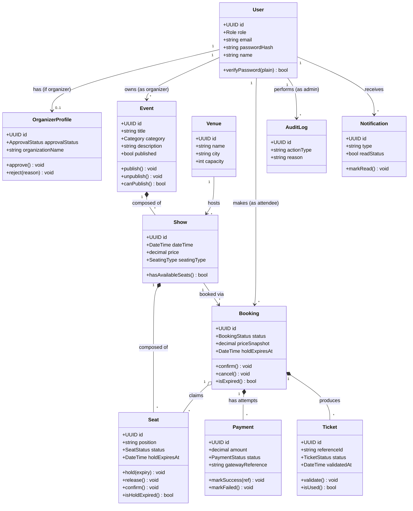
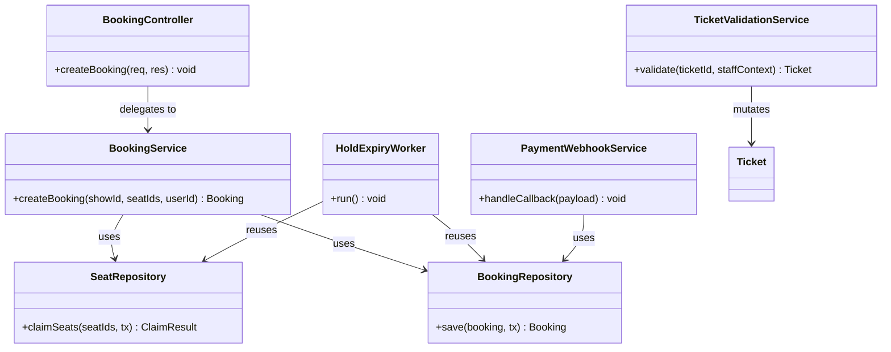
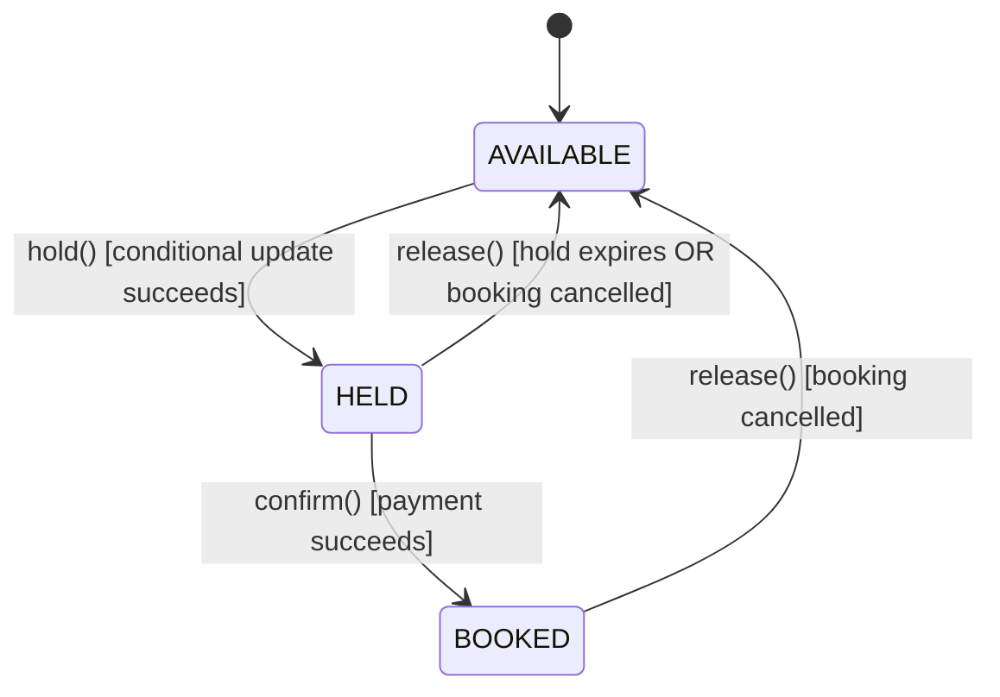
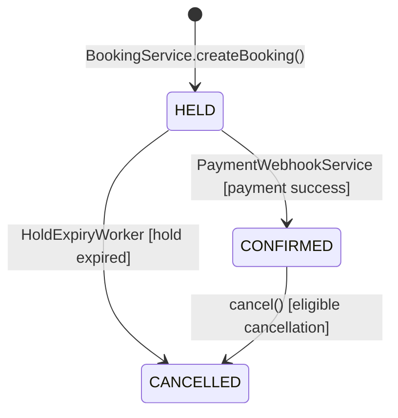
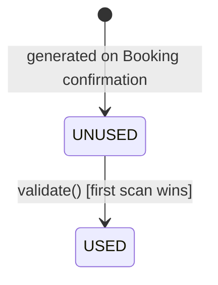
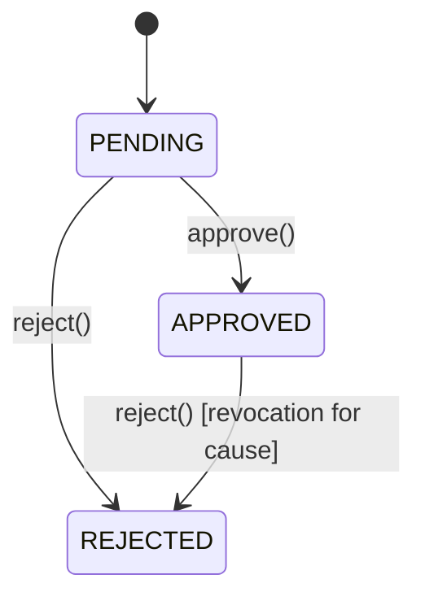
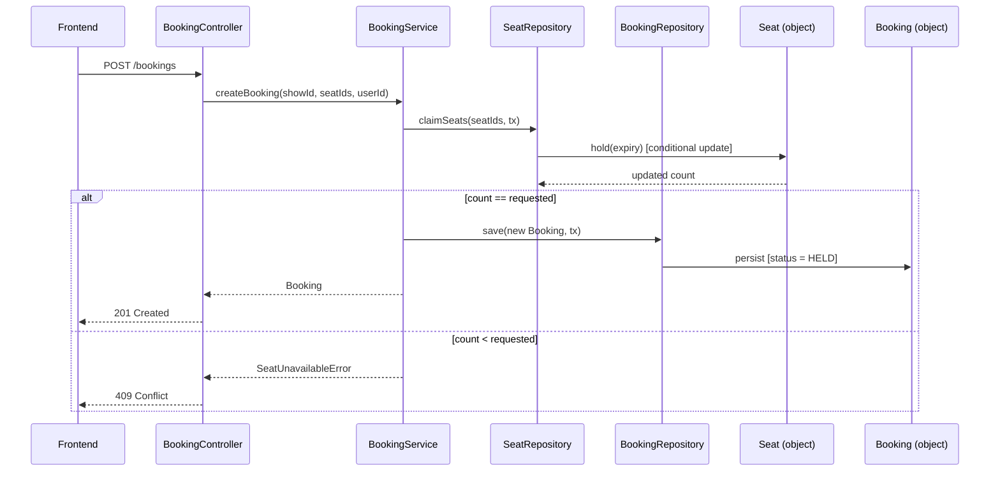

# Object-Oriented Analysis & Design (OOAD)
## Evoria — Event Ticketing Platform

| Field | Value |
|---|---|
| Document | Object-Oriented Analysis & Design |
| Product | Evoria |
| Version | 1.0 |
| Depends On | [Phase 3 — Database Design](phase-3-database-design.md), [Phase 5 — LLD](phase-5-lld.md) |
| Relationship to Phase Sequence | Complements Phase 3 (data shape) and Phase 5 (layer responsibilities) with object-oriented structure — class relationships, behavior, and state — consumed directly by Phase 9 (Implementation) |

---

## 1. Purpose

Phase 3 defined Evoria's data shape (tables, columns, foreign keys). Phase 5 defined layer responsibilities (Controller/Service/Repository, inputs/outputs/dependencies). Neither captured **object behavior** — what operations a domain object exposes, what relationships are compositions versus associations, or how an object's state legally transitions over time. This document fills that gap, in the form code in Phase 9 will directly follow.

---

## 2. Domain Class Diagram

### 2.1 Relationship Type Key

| Symbol | Meaning | Example |
|---|---|---|
| `*--` (composition) | Child cannot exist without parent; deleting parent deletes children | `Event *-- Show` — a Show has no meaning without its Event |
| `o--` (aggregation) | Child can exist independently; parent just references it | `Booking o-- Seat` — a Seat exists before and after any one Booking claims it |
| `-->` (association) | A reference relationship, no ownership implication | `User --> Booking` — a User references Bookings they made |

### 2.2 Deliberate Consistency with Phase 3
`User` is **not** subclassed into `Attendee`/`Organizer`/`Admin` here, even though OOP inheritance might seem natural. This stays consistent with the schema decision made in Phase 3, §4.2 — role is a field, not a type hierarchy, with `OrganizerProfile` as the one extension class for organizer-only data. Introducing inheritance here would create a mismatch between the object model and the relational schema it's persisted to.

---

## 3. Service & Repository Class Diagram (Phase 5 → OOP View)

This is the object-oriented expression of Phase 5's module table — the same dependency rules, drawn as class relationships rather than a responsibility table.

---

## 4. State Diagrams

State diagrams capture what Phase 3's `status` enum columns and Phase 5's algorithms only implied — the **legal transitions** between states, and what's explicitly forbidden.

### 4.1 Seat Lifecycle

**Illegal transitions (by design):** `AVAILABLE → BOOKED` directly (must pass through `HELD` — this is precisely what `BookingService`'s atomic claim, Phase 5 Module 2, enforces structurally).

### 4.2 Booking Lifecycle

**Illegal transitions:** `CONFIRMED → HELD` (a confirmed Booking can never revert to held — cancellation is the only reverse path, and it terminates rather than reverting).

### 4.3 Ticket Lifecycle

**Illegal transitions:** `USED → UNUSED`. This is intentionally a one-way door — there is no method in the class diagram (§2) that reverses it, mirroring the "first scan wins, no undo" rule from Phase 1, Flow 4.

### 4.4 Organizer Profile Lifecycle

**Note:** unlike the other three state machines, `APPROVED → REJECTED` is a legal transition (Phase 4, Endpoint 11 explicitly allows revoking approval after the fact) — unlike Ticket's one-way door, this state machine permits a later re-decision.

---

## 5. Key Use Case Sequence Diagram (Object Interaction View)

The Booking Flow (Phase 1) redrawn at the object/method level, showing exactly which class method is called at each step:

---

## 6. Design Principles Applied

| Principle | Where Applied |
|---|---|
| **Single Responsibility** | Each class in §2 owns exactly one entity's data and behavior; each class in §3 owns exactly one layer's responsibility |
| **Encapsulation** | State transitions (§4) only happen through named methods (`hold()`, `confirm()`, `cancel()`) — never by directly setting a status field, keeping illegal transitions structurally harder to reach |
| **Composition over Inheritance** | `Event *-- Show`, `Show *-- Seat` use composition; `User` deliberately avoids subclassing (§2.2), consistent with Phase 3's schema |
| **Dependency Direction** | §3 mirrors Phase 5 exactly — Controller depends on Service, Service depends on Repository, never the reverse |

---

## 7. Out of Scope for This Document

- Full method signatures and parameter types for every class (resolved incrementally during Phase 9 — Implementation)
- Database column-level detail (Phase 3 remains authoritative for schema)
