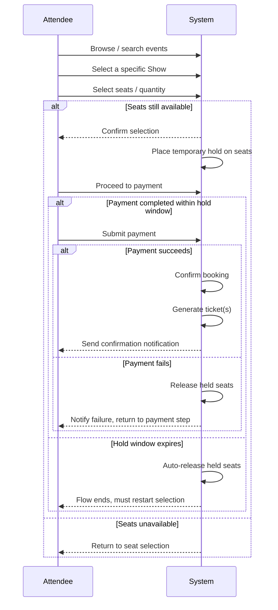
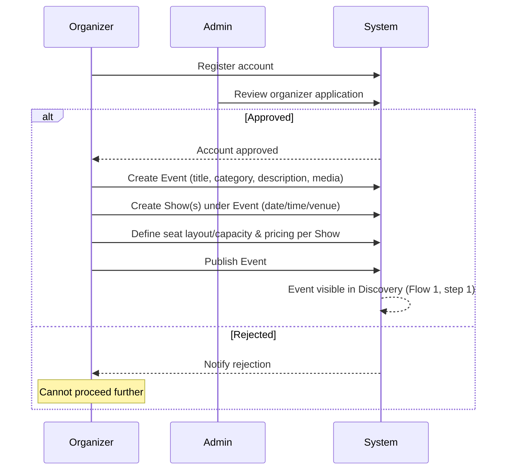
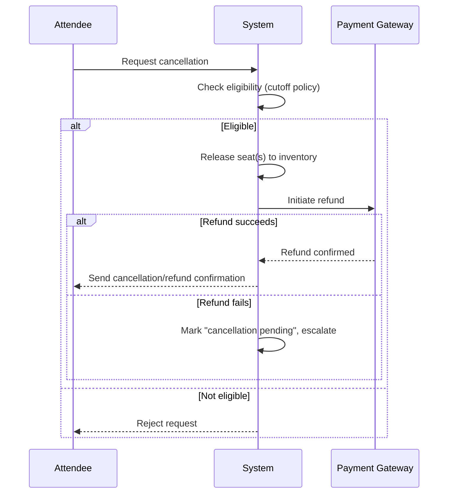
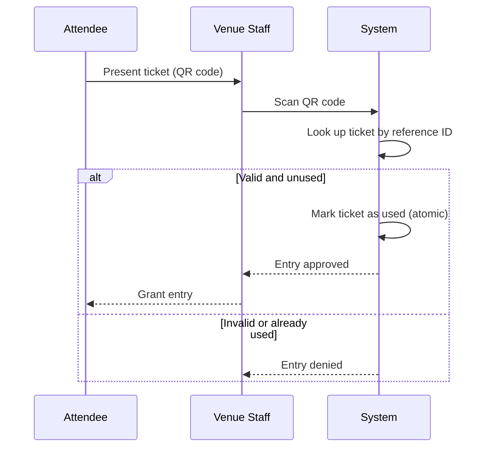
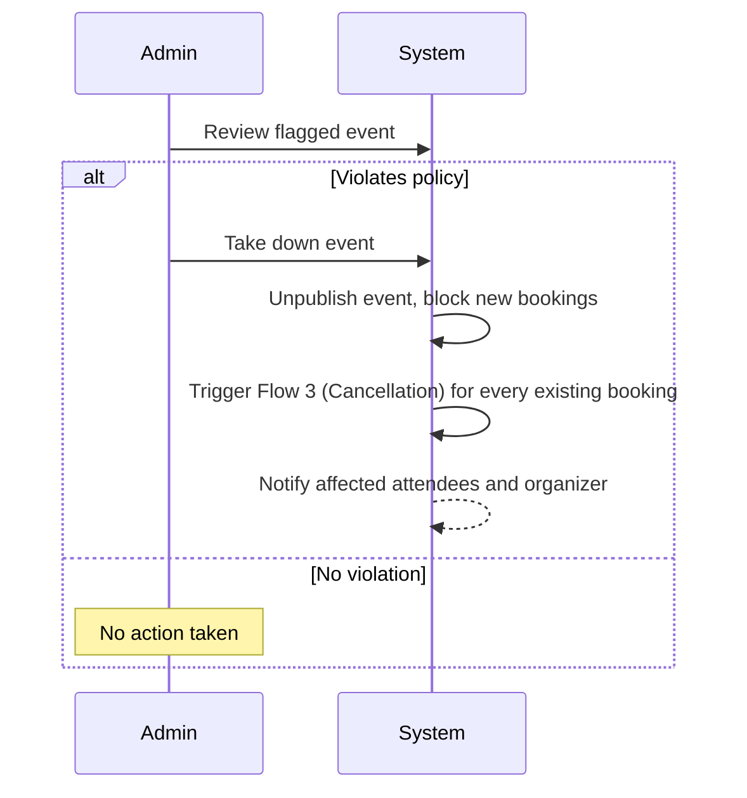
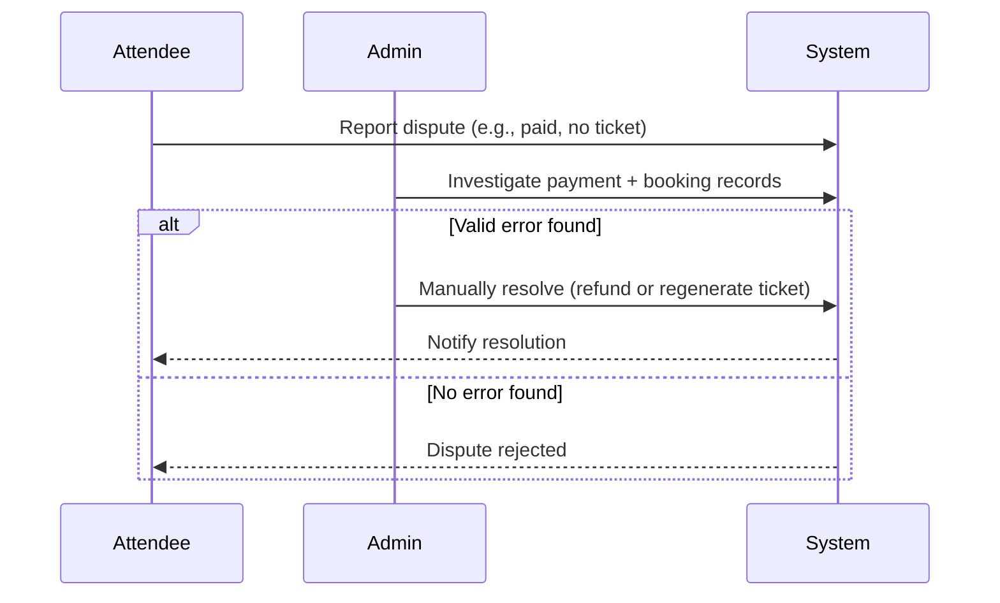
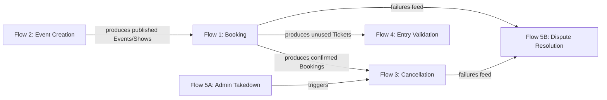

# Business Flow Design
## Evoria — Event Ticketing Platform

| Field | Value |
|---|---|
| Document | Business Flow Design |
| Product | Evoria |
| Version | 1.0 |
| Depends On | [Phase 0 — PRD](phase-0-prd.md) |

---

## 1. Purpose

This document defines the ordered, step-by-step sequences ("flows") by which each Actor (Phase 0, Section 4) accomplishes a goal in Evoria — including every decision point, branch, and failure path. The PRD defines requirements in isolation (e.g., "the system must allow booking," "the system must allow payment"); this document connects those isolated requirements into real, ordered journeys, and is where integration gaps and failure handling are designed before any architecture exists.

Every flow below references the Functional Requirement(s) it implements from the PRD.

---

## 2. Flow Index

| # | Flow Name | Primary Actor | Implements |
|---|---|---|---|
| 1 | Attendee Booking Flow | Attendee | FR-1, FR-2, FR-3, FR-4 |
| 2 | Organizer Event Creation Flow | Organizer, Admin | FR-5, FR-8 |
| 3 | Cancellation & Refund Flow | Attendee | FR-6 |
| 4 | Ticket Validation (Entry) Flow | Venue Staff | FR-4 |
| 5 | Admin Takedown & Dispute Resolution Flow | Admin | FR-8 |

---

## 3. Flow 1 — Attendee Booking Flow

### 3.1 Overview
The end-to-end journey of an Attendee from finding a Show to holding a confirmed, paid ticket. This is the platform's primary revenue-generating flow and its most consistency-critical sequence.

### 3.2 Preconditions
- The Attendee has a valid account (or proceeds as Guest until checkout, where authentication is required)
- At least one published Event with at least one Show exists

### 3.3 Sequence Diagram

### 3.4 Step Table

| Step | Actor | Action | Decision Point | Failure Path | Resulting State |
|---|---|---|---|---|---|
| 1 | Attendee | Browses/searches events | — | — | — |
| 2 | Attendee | Selects a specific Show | — | — | — |
| 3 | Attendee | Selects seats/quantity | Are seats still available? | If unavailable → return to step 3 | — |
| 4 | System | Places a temporary hold on selected seats | — | — | Booking: `held` |
| 5 | Attendee | Proceeds to payment | Completed within hold window? | If hold expires → seats auto-released, flow ends | Booking: `held` → released |
| 6 | Attendee → Gateway | Submits payment | Did payment succeed? | If failed → seats released, attendee notified, return to step 5 | Payment: `pending` → `success`/`failed` |
| 7 | System | Confirms booking | — | — | Booking: `held` → `confirmed` |
| 8 | System | Generates ticket(s) | — | — | Ticket(s): `unused` |
| 9 | System | Sends confirmation notification | — | — | Notification: created |

### 3.5 Postconditions
- **Success:** Booking is `confirmed`, one Ticket exists per seat/unit, Attendee has been notified
- **Failure (any branch):** No seats remain held by this Attendee; inventory is fully released

### 3.6 Design Notes
There are **two distinct failure modes** at payment, requiring different handling: an **explicit failure** (step 6, retry-able immediately) versus a **silent timeout** (step 5, the hold is already gone by the time the user notices — e.g., a slow OTP verification outlasting the hold window). Both must be designed for explicitly; the timeout path is the one most commonly overlooked in real implementations.

---

## 4. Flow 2 — Organizer Event Creation Flow

### 4.1 Overview
The supply-side counterpart to Flow 1 — how an Event becomes available for Attendees to discover and book. Gated by a one-time Organizer approval check.

### 4.2 Preconditions
- The Organizer has registered an account

### 4.3 Sequence Diagram

### 4.4 Step Table

| Step | Actor | Action | Decision Point | Failure Path | Resulting State |
|---|---|---|---|---|---|
| 1 | Organizer | Registers an account | — | — | OrganizerProfile: `pending` |
| 2 | Admin | Reviews and approves/rejects organizer | Is the organizer approved? | If rejected → organizer notified, cannot proceed | OrganizerProfile: `approved`/`rejected` |
| 3 | Organizer | Creates an Event | — | — | Event: `unpublished` |
| 4 | Organizer | Creates one or more Shows under the Event | — | — | Show(s) created |
| 5 | Organizer | Defines seat layout/capacity and pricing per Show | — | — | Seat(s) created |
| 6 | Organizer | Publishes the Event | Does the Event have ≥1 Show? | If zero Shows → publish blocked | Event: `unpublished` → `published` |

### 4.5 Postconditions
- **Success:** Event is `published` and visible to Discovery (Flow 1, step 1); all of its Shows are bookable
- **Failure:** Organizer remains blocked at step 2 (rejected), or cannot publish at step 6 (no Shows)

### 4.6 Design Notes
Step 2 is a **one-time, per-account** gate, not a per-Event check — once approved, an Organizer can create and publish freely. This trades slower organizer onboarding for platform trust (see PRD NFR-4).

---

## 5. Flow 3 — Cancellation & Refund Flow

### 5.1 Overview
The reverse of Flow 1 — how a confirmed Booking is safely unwound, releasing inventory and reversing payment.

### 5.2 Preconditions
- A `confirmed` Booking exists (produced by Flow 1)

### 5.3 Sequence Diagram

### 5.4 Step Table

| Step | Actor | Action | Decision Point | Failure Path | Resulting State |
|---|---|---|---|---|---|
| 1 | Attendee | Requests cancellation of a confirmed Booking | — | — | — |
| 2 | System | Checks cancellation eligibility (cutoff policy) | Eligible? | If not eligible → rejected, attendee notified | — |
| 3 | System | Releases seat(s) back into inventory | — | — | Seat(s): `booked` → `available` |
| 4 | System | Initiates refund request to Payment Gateway | — | — | Payment: refund `pending` |
| 5 | Gateway | Processes refund | Succeeded? | If failed → marked "cancellation pending," escalated | Payment: `refunded`/pending review |
| 6 | System | Sends cancellation/refund confirmation | — | — | Notification: created |

### 5.5 Postconditions
- **Success:** Booking is `cancelled`, seats are `available` again, Payment is `refunded`
- **Partial failure:** Seats are released (never blocked on refund outcome), but Booking is flagged for manual follow-up if the refund fails

### 5.6 Design Notes
Seat release (step 3) happens **before** refund confirmation (step 5) — a deliberate ordering decision. Inventory availability for other Attendees takes priority over the comparatively rare case of refund failure. Partial-failure states (cancelled but not yet refunded) must be explicit and trackable, never silent.

---

## 6. Flow 4 — Ticket Validation (Entry) Flow

### 6.1 Overview
The final step of the Attendee's journey — presenting a Ticket at the venue for entry, validated exactly once.

### 6.2 Preconditions
- An `unused` Ticket exists (produced by Flow 1)

### 6.3 Sequence Diagram

### 6.4 Step Table

| Step | Actor | Action | Decision Point | Failure Path | Resulting State |
|---|---|---|---|---|---|
| 1 | Attendee | Presents ticket (QR code) at venue | — | — | — |
| 2 | Venue Staff | Scans the QR code | — | — | — |
| 3 | System | Looks up ticket status by reference ID | Valid and unused? | If invalid/used → entry denied | — |
| 4 | System | Marks ticket as used, atomically | Race with another scan? | Only the first scan succeeds | Ticket: `unused` → `used` |
| 5 | Venue Staff | Grants entry | — | — | — |

### 6.5 Design Notes
Step 4 re-encounters the **exact same concurrency problem** as seat booking (PRD NFR-1) — applied to entry instead of allocation. The QR code is only a reference; validity is always decided by a real-time, server-side check, never by trusting the code's contents in isolation.

---

## 7. Flow 5 — Admin Takedown & Dispute Resolution Flow

### 7.1 Overview
The human-in-the-loop safety net for Evoria, covering both Admin-initiated enforcement and Attendee-initiated disputes.

### 7.2 Path A — Event Takedown (Admin-initiated)

| Step | Actor | Action | Decision Point | Failure Path |
|---|---|---|---|---|
| 1 | Admin | Reviews a flagged Event | — | — |
| 2 | Admin | Decides whether to take it down | Violates policy? | If not → no action |
| 3 | System | Unpublishes Event, blocks new bookings | — | — |
| 4 | System | Triggers Flow 3 (Cancellation) for every existing Booking | — | — |
| 5 | System | Notifies affected Attendees and the Organizer | — | — |

### 7.3 Path B — Dispute Resolution (Attendee-initiated)

| Step | Actor | Action | Decision Point | Failure Path |
|---|---|---|---|---|
| 1 | Attendee | Reports a dispute | — | — |
| 2 | Admin | Investigates payment + booking records | Valid error found? | If not → dispute rejected |
| 3 | Admin | Manually resolves (refund or regenerate ticket) | — | — |
| 4 | System | Notifies Attendee of resolution | — | — |

### 7.4 Design Notes
Path A **reuses Flow 3 (Cancellation)** rather than inventing parallel takedown-specific logic — when an Event is taken down, every existing Booking under it unwinds exactly the way a normal cancellation would. Path B is the only flow in the system involving genuine manual human judgment rather than full automation.

---

## 8. Cross-Flow Dependency Map

| Flow | Role | Consumes State From |
|---|---|---|
| Flow 2 (Event Creation) | **Producer** | — |
| Flow 1 (Booking) | **Producer** | Flow 2 |
| Flow 3 (Cancellation) | Consumer | Flow 1, Flow 5A |
| Flow 4 (Entry Validation) | Consumer | Flow 1 |
| Flow 5A (Takedown) | Consumer/Trigger | Flow 2 |
| Flow 5B (Dispute Resolution) | Consumer | Flow 1, Flow 3 |

**Producer flows** (Event Creation, Booking) create new state. **Consumer flows** (Cancellation, Entry Validation, Admin actions) act on state created elsewhere. This shape directly informs the High Level Design (Phase 2) — it indicates which components must own write authority over which data.
