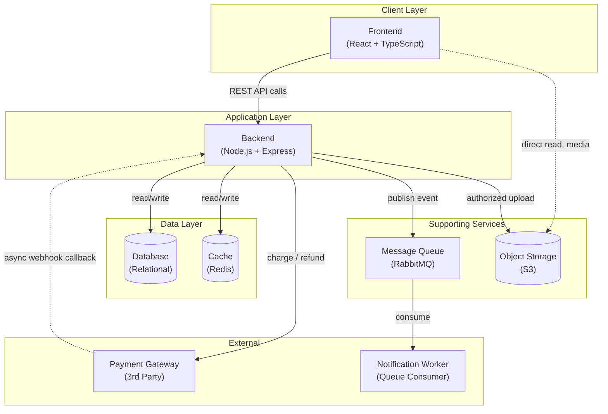

# High Level Design (HLD)
## Evoria — Event Ticketing Platform

| Field | Value |
|---|---|
| Document | High Level Design |
| Product | Evoria |
| Version | 1.0 |
| Depends On | [Phase 0 — PRD](phase-0-prd.md), [Phase 1 — Business Flows](phase-1-business-flows.md) |

---

## 1. Purpose

This document identifies Evoria's major system components and defines, for each: its responsibility, its boundaries (what it must *not* do), and its interactions with other components. It deliberately does **not** define database schemas, API contracts, or internal class design — those are Phases 3, 4, and 5 respectively. The goal here is to establish clear *ownership* of behavior across the system before any of that detail is designed.

---

## 2. Architecture Overview

**Legend:** solid arrows = synchronous request/response; dashed arrows = asynchronous or read-only/bypass paths.

---

## 3. Component Specifications

### 3.1 Frontend (Client)

| Attribute | Detail |
|---|---|
| **Technology** | React, TypeScript, Vite, React Router, TanStack Query, Zustand |
| **Why it exists** | Every flow in Phase 1 begins with a human action; the Frontend is the sole entry point for human interaction with the system |
| **Responsibilities** | Render events/shows/seat maps/forms; capture user input; reflect real-time state back to the user |
| **Boundaries** | Never the source of truth for availability, pricing, or booking status. Never executes business logic. Never accesses the Database directly |
| **Interacts With** | Backend (all reads/writes); Object Storage (direct, read-only, for media) |
| **Failure Mode Considered** | If the Backend is unreachable, the Frontend must degrade gracefully (e.g., show cached/last-known state) rather than silently fail |

---

### 3.2 Backend (API Server)

| Attribute | Detail |
|---|---|
| **Technology** | Node.js, Express, TypeScript — layered as Controller → Service → Repository (see Phase 5) |
| **Why it exists** | The Frontend cannot be trusted to enforce business rules; the Backend is the single enforcement layer for every rule defined in the PRD |
| **Responsibilities** | Validate requests; enforce business rules (seat consistency, cancellation eligibility, organizer approval); orchestrate every flow from Phase 1 step by step; the sole source of truth the Frontend defers to |
| **Boundaries** | Does not persist data long-term itself (delegates to Database). Never handles raw payment details (delegates to Payment Gateway). Never renders UI |
| **Interacts With** | Database, Cache, Payment Gateway, Message Queue, Object Storage (authorize writes) |
| **Scaling Note** | Stateless by design — horizontally scalable behind a load balancer, since no session state is held in-process (NFR-2) |

---

### 3.3 Database

| Attribute | Detail |
|---|---|
| **Technology** | Relational (SQL) — specific product selected in Phase 3 |
| **Why it exists** | State created by every flow (bookings, events, cancellations) must outlive the single request that caused it |
| **Responsibilities** | Durably store all platform data; guarantee data integrity for critical operations (e.g., seat consistency, NFR-1) at the storage level; serve data back to the Backend reliably |
| **Boundaries** | Never accessed directly by the Frontend. Does not decide presentation. Schema design deliberately deferred to Phase 3 |
| **Interacts With** | Backend only |
| **NFR Alignment** | NFR-1 (Consistency) is primarily enforced here via ACID transactions |

---

### 3.4 Payment Gateway (External Service)

| Attribute | Detail |
|---|---|
| **Technology** | Third-party, integrated via API (not built in-house) |
| **Why it exists** | FR-3 establishes that Evoria never touches raw payment data; this external system performs that function on Evoria's behalf |
| **Responsibilities** | Securely collect payment details; charge the Attendee and report status; process refunds initiated by the Backend |
| **Boundaries** | Not Evoria's code. Never blindly trusted — payment status is always independently verified server-to-server via webhook, never via client redirect alone. Receives only transaction-relevant data |
| **Interacts With** | Backend (charge/refund requests out; async status callbacks in) |
| **NFR Alignment** | NFR-3 (Availability) — Payment prioritizes reliability of state over raw uptime |

---

### 3.5 Cache (Redis)

| Attribute | Detail |
|---|---|
| **Technology** | Redis |
| **Why it exists** | NFR-2 requires absorbing read-heavy Discovery traffic without hammering the Database; seat holds (FR-2) require automatic time-based expiry, which caching systems provide natively via TTL |
| **Responsibilities** | Store frequently-read data (event/show listings) to reduce Database load; hold short-lived data (seat holds) with auto-expiry |
| **Boundaries** | Never the permanent source of truth — the system must survive a full cache wipe without losing correctness. No business logic. Data may be stale, acceptable only for non-critical reads (Discovery), per NFR-3 |
| **Interacts With** | Backend only |
| **NFR Alignment** | NFR-2 (Scalability — read path), NFR-3 (Availability — Discovery tolerates staleness) |

---

### 3.6 Message Queue (RabbitMQ)

| Attribute | Detail |
|---|---|
| **Technology** | RabbitMQ |
| **Why it exists** | FR-7 requires that notification dispatch never blocks the action that triggered it; the queue decouples "something happened" from "something reacts to it" |
| **Responsibilities** | Receive messages from the Backend representing completed events; hold them reliably; allow a separate consumer to process them independently and at its own pace |
| **Boundaries** | No business logic — transport only. Not the source of truth (the Database remains authoritative even if a message is lost). Never used for anything requiring an immediate synchronous response |
| **Interacts With** | Backend (publishes) → Notification Worker (consumes) |
| **Technology Choice Rationale** | RabbitMQ (task-queue semantics) was chosen over Kafka (event-streaming/replay semantics) because the current need — dispatch a notification once per event — is a one-shot task pattern, not high-throughput stream replay. Adopting Kafka now would be premature (YAGNI); it remains a candidate for a future Analytics module |

---

### 3.7 Object Storage (S3)

| Attribute | Detail |
|---|---|
| **Technology** | AWS S3 |
| **Why it exists** | FR-5 requires Organizers to upload media for Events; large binary files do not belong in a relational database designed for structured data |
| **Responsibilities** | Store large binary files reliably; serve them efficiently, often directly to the Frontend; scale independently of Database/Backend |
| **Boundaries** | Never stores structured/query-able business data. No business logic. Uploads (writes) must be authorized through the Backend; downloads (reads) may bypass the Backend for performance |
| **Interacts With** | Backend (authorizes uploads); Frontend (direct reads) |
| **NFR Alignment** | NFR-2 (Scalability) — removes media traffic from the Backend's critical path |

---

## 4. Component Interaction Matrix

| From → To | Frontend | Backend | Database | Cache | Payment Gateway | Message Queue | Object Storage |
|---|---|---|---|---|---|---|---|
| **Frontend** | — | ✅ all reads/writes | ❌ | ❌ | ❌ | ❌ | ✅ direct reads only |
| **Backend** | response only | — | ✅ | ✅ | ✅ | ✅ publish | ✅ authorize writes |
| **Payment Gateway** | ❌ | ✅ async callback | ❌ | ❌ | — | ❌ | ❌ |
| **Message Queue** | ❌ | ❌ | ❌ | ❌ | ❌ | — | ❌ |

The Backend is the **only** component permitted to reach the Database, Cache, Payment Gateway, and Message Queue — it is the hub of the entire architecture, consistent with its role as the sole enforcement layer.

---

## 5. Flow-to-Component Traceability

| Business Flow (Phase 1) | Components Involved, in Order |
|---|---|
| Flow 1 — Booking | Frontend → Backend → Cache (seat hold) → Payment Gateway (charge) → Database (confirm) → Message Queue (notify) |
| Flow 2 — Event Creation | Frontend → Backend → Object Storage (media) → Database (Event/Show record) |
| Flow 3 — Cancellation | Frontend → Backend → Database (release seat) → Payment Gateway (refund) → Message Queue (notify) |
| Flow 4 — Entry Validation | Venue Staff scanner → Backend → Database (atomic ticket-used check) |
| Flow 5 — Admin Actions | Frontend → Backend → Database (state change + Audit Log) → Message Queue (notify) |

---

## 6. Non-Functional Requirement Coverage

| NFR (from PRD) | Primarily Addressed By |
|---|---|
| NFR-1 Consistency | Database (ACID transactions), Backend (orchestration) |
| NFR-2 Scalability | Cache (read path), Message Queue (write decoupling), Object Storage (media offload), stateless Backend (horizontal scaling) |
| NFR-3 Availability | Cache (Discovery tolerates staleness), Payment Gateway integration (reliability over uptime) |
| NFR-4 Security | Backend (sole enforcement layer for authn/authz), Payment Gateway (PCI boundary — raw payment data never enters Evoria) |

---

## 7. Out of Scope for This Document

- Specific database product selection and schema (Phase 3)
- API endpoint contracts (Phase 4)
- Internal class/module design, locking strategy implementation (Phase 5)
