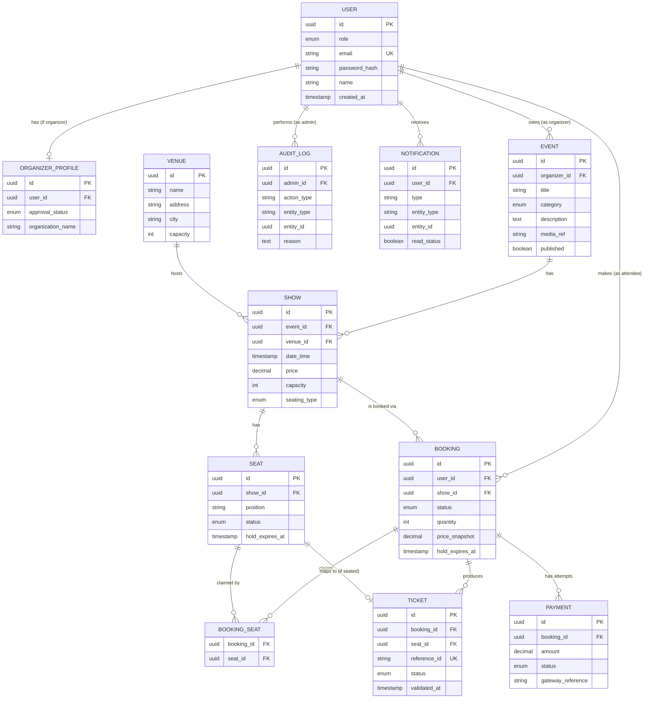

# Database Design
## Evoria — Event Ticketing Platform

| Field | Value |
|---|---|
| Document | Database Design |
| Product | Evoria |
| Version | 1.0 |
| Depends On | [Phase 0 — PRD](phase-0-prd.md), [Phase 2 — HLD](phase-2-hld.md) |

---

## 1. Purpose

This document defines Evoria's persistent data model: the database category decision, every entity (table), its fields, constraints, relationships, and indexing strategy. It does not define API contracts (Phase 4) or implementation/locking mechanics (Phase 5) — only the structure and integrity rules of the data itself.

---

## 2. Database Type Decision

**Decision: Relational (SQL).** Specific product selection (e.g., PostgreSQL) is an infrastructure decision outside this document's scope, but the category is fixed here.

**Justification:**
- **NFR-1 (Consistency):** Seat allocation must be strongly consistent — no double-booking under any concurrency condition. Relational databases provide native ACID transactions, the most direct, proven mechanism for this guarantee.
- **Data shape:** Users, Events, Shows, Bookings, Payments, and Tickets have strict, well-defined relationships (foreign keys, not flexible/document-shaped data) — a natural fit for relational modeling.
- **FR-5 (Event ≠ Show):** This one-to-many structure is a textbook relational pattern.

---

## 3. Entity Relationship Diagram

---

## 4. Entity Definitions

### 4.1 User
Base identity entity for any authenticated actor.

| Column | Type | Constraints | Notes |
|---|---|---|---|
| `id` | UUID | PK | |
| `role` | ENUM(`ATTENDEE`, `ORGANIZER`, `ADMIN`) | NOT NULL | Distinguishes actor type; extra role-specific data lives in extension tables |
| `email` | VARCHAR(255) | NOT NULL, UNIQUE | Login identifier |
| `password_hash` | VARCHAR(255) | NOT NULL | Hashed (e.g., bcrypt/argon2) — never plaintext or reversibly encrypted |
| `name` | VARCHAR(255) | NOT NULL | |
| `phone` | VARCHAR(20) | NULLABLE | |
| `created_at` | TIMESTAMP | NOT NULL, DEFAULT now() | |
| `updated_at` | TIMESTAMP | NOT NULL | |

**Indexes:** UNIQUE index on `email`.

---

### 4.2 Organizer Profile
One-to-one extension of `User` for Organizer-only data (resolves role-specific data without bloating `User`).

| Column | Type | Constraints | Notes |
|---|---|---|---|
| `id` | UUID | PK | |
| `user_id` | UUID | FK → `User.id`, UNIQUE, NOT NULL | One profile per organizer User |
| `approval_status` | ENUM(`PENDING`, `APPROVED`, `REJECTED`) | NOT NULL, DEFAULT `PENDING` | Gates Event creation (FR-5, FR-8) |
| `organization_name` | VARCHAR(255) | NOT NULL | Display name shown to Attendees |
| `created_at` | TIMESTAMP | NOT NULL | |
| `updated_at` | TIMESTAMP | NOT NULL | |

**Indexes:** UNIQUE index on `user_id`.

---

### 4.3 Event
The abstract, reusable offering an Organizer promotes.

| Column | Type | Constraints | Notes |
|---|---|---|---|
| `id` | UUID | PK | |
| `organizer_id` | UUID | FK → `User.id`, NOT NULL | |
| `title` | VARCHAR(255) | NOT NULL | |
| `category` | ENUM(`MOVIE`, `CONCERT`, `SPORT`, `WORKSHOP`, `COMEDY`, `FESTIVAL`) | NOT NULL | |
| `description` | TEXT | NULLABLE | |
| `media_ref` | VARCHAR(512) | NULLABLE | Pointer to Object Storage (S3 key), not the file itself |
| `published` | BOOLEAN | NOT NULL, DEFAULT `false` | Controls visibility in Discovery (FR-1) |
| `created_at` | TIMESTAMP | NOT NULL | |
| `updated_at` | TIMESTAMP | NOT NULL | |

**Indexes:** index on `(category, published)` to support Discovery filtering; index on `organizer_id`.

**Constraint (enforced at application/Service layer, Phase 5):** an Event cannot be set `published = true` while it has zero associated Shows.

---

### 4.4 Venue
A reusable physical location, referenced by many Shows over time.

| Column | Type | Constraints | Notes |
|---|---|---|---|
| `id` | UUID | PK | |
| `name` | VARCHAR(255) | NOT NULL | |
| `address` | VARCHAR(512) | NOT NULL | |
| `city` | VARCHAR(100) | NOT NULL | Supports city-based search (FR-1) |
| `capacity` | INTEGER | NOT NULL | High-level total; per-seat detail lives in `Seat` |
| `created_at` | TIMESTAMP | NOT NULL | |

**Indexes:** index on `city`.

---

### 4.5 Show
A specific, bookable occurrence of an Event.

| Column | Type | Constraints | Notes |
|---|---|---|---|
| `id` | UUID | PK | |
| `event_id` | UUID | FK → `Event.id`, NOT NULL | |
| `venue_id` | UUID | FK → `Venue.id`, NOT NULL | |
| `date_time` | TIMESTAMP | NOT NULL | |
| `price` | DECIMAL(10,2) | NOT NULL | Per-occurrence price; may differ from other Shows of the same Event |
| `capacity` | INTEGER | NOT NULL | |
| `seating_type` | ENUM(`SEATED`, `GENERAL_ADMISSION`) | NOT NULL | Determines whether `Seat` rows or a quantity counter is used for this Show |
| `created_at` | TIMESTAMP | NOT NULL | |
| `updated_at` | TIMESTAMP | NOT NULL | |

**Indexes:** index on `event_id`; index on `(venue_id, date_time)`.

---

### 4.6 Seat
An individual, bookable seat position for a `SEATED` Show — the atomic unit on which NFR-1 (Consistency) is enforced.

| Column | Type | Constraints | Notes |
|---|---|---|---|
| `id` | UUID | PK | |
| `show_id` | UUID | FK → `Show.id`, NOT NULL | |
| `position` | VARCHAR(20) | NOT NULL | e.g., row/seat/section label |
| `status` | ENUM(`AVAILABLE`, `HELD`, `BOOKED`) | NOT NULL, DEFAULT `AVAILABLE` | |
| `hold_expires_at` | TIMESTAMP | NULLABLE | Set when `status = HELD`; TTL-style expiry mirrors the Cache layer (Phase 2) |
| `created_at` | TIMESTAMP | NOT NULL | |
| `updated_at` | TIMESTAMP | NOT NULL | |

**Indexes:** UNIQUE index on `(show_id, position)`; index on `(show_id, status)` — the latter is the hottest query path in the system (seat-map reads, hold attempts).

**Not used for `GENERAL_ADMISSION` Shows** — those track availability as a simple counter against `Show.capacity` and `Booking.quantity` instead.

---

### 4.7 Booking
The central transactional record, joining demand (User) to supply (Show).

| Column | Type | Constraints | Notes |
|---|---|---|---|
| `id` | UUID | PK | |
| `user_id` | UUID | FK → `User.id`, NOT NULL | |
| `show_id` | UUID | FK → `Show.id`, NOT NULL | |
| `status` | ENUM(`HELD`, `CONFIRMED`, `CANCELLED`) | NOT NULL, DEFAULT `HELD` | Mirrors Flow 1 / Flow 3 lifecycle |
| `quantity` | INTEGER | NULLABLE | Used only for `GENERAL_ADMISSION` Shows |
| `price_snapshot` | DECIMAL(10,2) | NOT NULL | Amount actually charged — captured at booking time, never a live reference to `Show.price` |
| `hold_expires_at` | TIMESTAMP | NULLABLE | Set when `status = HELD` |
| `created_at` | TIMESTAMP | NOT NULL | |
| `updated_at` | TIMESTAMP | NOT NULL | |

**Indexes:** index on `user_id`; index on `show_id`; index on `(status, hold_expires_at)` to support the hold-expiry sweep job.

---

### 4.8 Booking Seat (Junction)
Resolves the many-to-many relationship between `Booking` and `Seat` for `SEATED` Shows.

| Column | Type | Constraints | Notes |
|---|---|---|---|
| `booking_id` | UUID | FK → `Booking.id`, PK (composite) | |
| `seat_id` | UUID | FK → `Seat.id`, PK (composite), UNIQUE | A Seat can belong to at most one *active* Booking |

**Indexes:** composite PK on `(booking_id, seat_id)`; UNIQUE index on `seat_id` enforces that a Seat can never be claimed by two Bookings simultaneously at the database level.

---

### 4.9 Payment
Every financial transaction attempt against a Booking (one Booking may have several, e.g., retries after failure).

| Column | Type | Constraints | Notes |
|---|---|---|---|
| `id` | UUID | PK | |
| `booking_id` | UUID | FK → `Booking.id`, NOT NULL | |
| `amount` | DECIMAL(10,2) | NOT NULL | |
| `status` | ENUM(`PENDING`, `SUCCESS`, `FAILED`, `REFUNDED`) | NOT NULL, DEFAULT `PENDING` | |
| `gateway_reference` | VARCHAR(255) | NULLABLE | External Payment Gateway transaction ID — used for status verification and refunds |
| `created_at` | TIMESTAMP | NOT NULL | |
| `updated_at` | TIMESTAMP | NOT NULL | |

**Indexes:** index on `booking_id`; UNIQUE index on `gateway_reference` (where not null) to support idempotent webhook processing.

**Explicit exclusion:** no column in this table ever stores raw card/bank details — that data never enters Evoria (FR-3, NFR-4).

---

### 4.10 Ticket
The proof-of-booking, entry-validation artifact — one row per Seat (or per quantity unit) within a Booking.

| Column | Type | Constraints | Notes |
|---|---|---|---|
| `id` | UUID | PK | |
| `booking_id` | UUID | FK → `Booking.id`, NOT NULL | |
| `seat_id` | UUID | FK → `Seat.id`, NULLABLE | Null for `GENERAL_ADMISSION` Bookings |
| `reference_id` | VARCHAR(64) | NOT NULL, UNIQUE | The value encoded into the QR code — a pointer, not the source of truth |
| `status` | ENUM(`UNUSED`, `USED`) | NOT NULL, DEFAULT `UNUSED` | |
| `validated_at` | TIMESTAMP | NULLABLE | Set on first successful scan |
| `created_at` | TIMESTAMP | NOT NULL | |

**Indexes:** UNIQUE index on `reference_id` (the lookup key at venue scan time).

---

### 4.11 Audit Log
Append-only, immutable record of every high-impact Admin action.

| Column | Type | Constraints | Notes |
|---|---|---|---|
| `id` | UUID | PK | |
| `admin_id` | UUID | FK → `User.id`, NOT NULL | |
| `action_type` | VARCHAR(100) | NOT NULL | e.g., `ORGANIZER_APPROVED`, `EVENT_TAKEDOWN` |
| `entity_type` | VARCHAR(50) | NOT NULL | Generic reference — which table the action affected |
| `entity_id` | UUID | NOT NULL | Generic reference — which row was affected |
| `reason` | TEXT | NULLABLE | |
| `created_at` | TIMESTAMP | NOT NULL | |

**Indexes:** index on `(entity_type, entity_id)`; index on `admin_id`.

**Hard rule:** this table supports `INSERT` only. No `UPDATE` or `DELETE` operations are permitted at the application layer — a correction is a new row, never an edit to history.

---

### 4.12 Notification
The queryable, in-app record of what a User has been told — separate from the actual delivery mechanism (Message Queue, Phase 2).

| Column | Type | Constraints | Notes |
|---|---|---|---|
| `id` | UUID | PK | |
| `user_id` | UUID | FK → `User.id`, NOT NULL | |
| `type` | VARCHAR(100) | NOT NULL | e.g., `BOOKING_CONFIRMED`, `PAYMENT_FAILED` |
| `entity_type` | VARCHAR(50) | NULLABLE | Generic reference, same pattern as Audit Log |
| `entity_id` | UUID | NULLABLE | |
| `read_status` | BOOLEAN | NOT NULL, DEFAULT `false` | |
| `created_at` | TIMESTAMP | NOT NULL | |

**Indexes:** index on `(user_id, read_status)` to support an unread-count query efficiently.

---

## 5. Relationship Summary

| Parent | Child | Cardinality | Notes |
|---|---|---|---|
| User | Organizer Profile | 1 : 0..1 | Only if `role = ORGANIZER` |
| User (Organizer) | Event | 1 : N | |
| Event | Show | 1 : N | An Event cannot publish with 0 Shows |
| Venue | Show | 1 : N | |
| Show | Seat | 1 : N | Only for `SEATED` Shows |
| User (Attendee) | Booking | 1 : N | |
| Show | Booking | 1 : N | |
| Booking | Seat (via Booking Seat) | N : N | Resolved via junction table; `seat_id` UNIQUE prevents double-claim |
| Booking | Payment | 1 : N | Multiple attempts per Booking |
| Booking | Ticket | 1 : N | One per Seat/unit |
| User (Admin) | Audit Log | 1 : N | |
| User | Notification | 1 : N | |

---

## 6. Schema-Level Integrity Rules (Summary)

1. `BookingSeat.seat_id` is UNIQUE — the database itself rejects a second Booking claiming an already-claimed Seat (NFR-1 enforcement).
2. `Payment.gateway_reference` is UNIQUE (where present) — supports safe, idempotent webhook reprocessing (FR-3).
3. `Ticket.reference_id` is UNIQUE — guarantees no two Tickets share a scannable identity.
4. `AuditLog` is append-only at the application layer — no update/delete path is exposed.
5. `Booking.price_snapshot` is captured at write time and never recalculated from `Show.price` — protects historical financial accuracy.

---

## 7. Two-Spine Schema Shape

- **Supply-side spine:** User (Organizer) → Event → Show → Venue / Seat
- **Demand-side spine:** User (Attendee) → Booking → Payment / Ticket
- **Booking** is the join point between the two spines — the schema's hub, mirroring the Backend's role as the architecture's hub (Phase 2).
- **Audit Log** and **Notification** are cross-cutting tables, referencing other entities generically rather than joining the core spine.

This schema is what Phase 4 (API Design) exposes through endpoints, and what Phase 5 (LLD) implements transactional/locking logic against.
