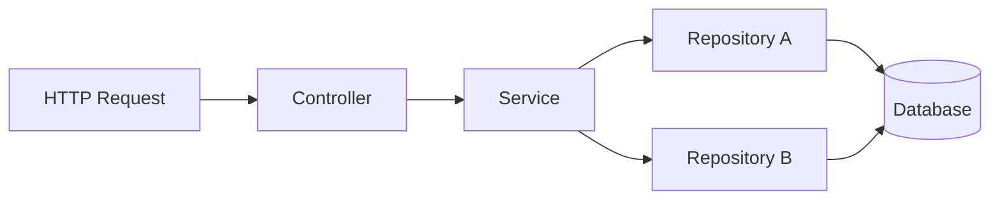
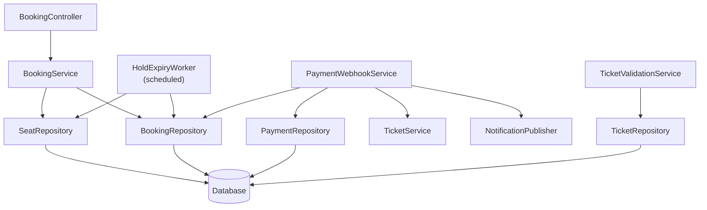

# Low Level Design (LLD)
## Evoria — Event Ticketing Platform

| Field | Value |
|---|---|
| Document | Low Level Design |
| Product | Evoria |
| Version | 1.0 |
| Depends On | [Phase 2 — HLD](phase-2-hld.md), [Phase 3 — Database Design](phase-3-database-design.md), [Phase 4 — API Design](phase-4-api-design.md) |
| Scope | Backend module design for the Booking, Payment, and Ticket-validation request paths |

---

## 1. Purpose

This document specifies the internal module structure of the Backend (Phase 2, Component 3.2) — the classes/modules responsible for each layer (Controller, Service, Repository), their responsibilities, inputs, outputs, and dependencies. It defines *how* the API contracts from Phase 4 and the consistency guarantees from Phase 0 (NFR-1) are actually implemented, without yet writing executable code (Phase 9).

---

## 2. Architectural Pattern: Layered (Controller → Service → Repository)

| Layer | Owns | Must Never Contain |
|---|---|---|
| **Controller** | HTTP request/response translation, request-shape validation | Business logic, direct database access |
| **Service** | Business rules, transaction boundaries, orchestration across Repositories | HTTP concepts (status codes, request/response objects), direct SQL |
| **Repository** | Data access — executing queries/updates, reporting raw outcomes | Business judgment about whether an outcome is "acceptable" |

**Rule:** each layer only calls the layer directly below it. A Controller never calls a Repository directly; a Repository never calls a Service.

---

## 3. Module Specifications

### 3.1 `BookingController`

| Attribute | Detail |
|---|---|
| **Type** | Controller |
| **Implements** | `POST /bookings` (Phase 4, §4.4) |
| **Responsibility** | Receive the HTTP request, validate request *shape* (e.g., `showId` and `seatIds` present and well-formed), extract the authenticated user from request context, call `BookingService`, and translate the result into an HTTP response |
| **Inputs** | Raw HTTP request: body (`showId`, `seatIds`/`quantity`), authenticated user from request context |
| **Outputs** | HTTP response: `201` with Booking payload, or an error status (`404`, `409`, `401`) derived from a typed domain error |
| **Dependencies** | `BookingService` |
| **Explicitly Excludes** | Any decision about seat availability — that determination is not made here |

---

### 3.2 `BookingService`

| Attribute | Detail |
|---|---|
| **Type** | Service |
| **Responsibility** | Enforce NFR-1 (Consistency) for seat allocation — atomically determine whether all requested seats can be claimed, and if so, claim them and create a `Booking` in `HELD` status |
| **Inputs** | `showId`, `seatIds` (or `quantity`), `userId` |
| **Outputs** | A `Booking` domain object (`HELD`, `holdExpiresAt` set) on success; a typed domain error (`SeatUnavailableError`, `ShowNotFoundError`) on failure |
| **Dependencies** | `SeatRepository`, `BookingRepository` |
| **Owns** | The database transaction boundary spanning both Repository calls |

**Core Algorithm (All-or-Nothing Seat Claim):**
1. Open a database transaction
2. Conditionally update all requested Seats: `AVAILABLE` → `HELD`, in one operation
3. Compare the count of rows actually updated against the count requested
4. If equal → create the `Booking` row, commit
5. If less → roll back entirely, return `SeatUnavailableError`

Backed at the schema level by the `UNIQUE` constraint on `BookingSeat.seat_id` (Phase 3, §4.8) as a final safety net against races the application logic might somehow miss.

---

### 3.3 `SeatRepository`

| Attribute | Detail |
|---|---|
| **Type** | Repository |
| **Responsibility** | Execute the conditional update against `Seat` rows; report the literal outcome (count and IDs of rows actually updated) |
| **Inputs** | List of `seatIds`; a transaction handle supplied by the caller |
| **Outputs** | Count/IDs of seats successfully transitioned to `HELD` |
| **Dependencies** | Database client only |
| **Explicitly Excludes** | Any judgment about whether a partial result is acceptable — that belongs to `BookingService` |

---

### 3.4 `BookingRepository`

| Attribute | Detail |
|---|---|
| **Type** | Repository |
| **Responsibility** | Persist the `Booking` row and its `BookingSeat` links |
| **Inputs** | Booking domain data (`userId`, `showId`, `status`, `holdExpiresAt`, `priceSnapshot`), `seatIds`, the same transaction handle used by `SeatRepository` |
| **Outputs** | The created `Booking` record, including generated `id` |
| **Dependencies** | Database client only |
| **Explicitly Excludes** | Computing `priceSnapshot` — that value is computed by `BookingService` and merely stored here |

---

### 3.5 `HoldExpiryWorker`

| Attribute | Detail |
|---|---|
| **Type** | Scheduled background worker (not request-driven) |
| **Implements** | The hold-timeout failure path (Phase 1, Flow 1, Step 5) |
| **Trigger** | Fixed schedule (e.g., every 30s), invoked by a Scheduler — no HTTP caller |
| **Responsibility** | Find Bookings where `status = HELD` and `holdExpiresAt < now()`; transition them to `CANCELLED` and release their Seats to `AVAILABLE` |
| **Inputs** | None (queries the Database directly using the index defined in Phase 3, §4.7) |
| **Outputs** | Updated database state only; no response |
| **Dependencies** | `SeatRepository`, `BookingRepository` — **reused, not duplicated**, from the synchronous booking path |

---

### 3.6 `PaymentWebhookService`

| Attribute | Detail |
|---|---|
| **Type** | Service |
| **Implements** | `POST /webhooks/payment-gateway` (Phase 4, §4.6) |
| **Responsibility** | Idempotently process a Payment Gateway callback — confirm the Booking and generate Tickets only on a genuinely new success, never on a duplicate delivery |
| **Inputs** | `gatewayReference`, `status`, `amount` (signature already verified by Controller-level middleware before this Service is invoked) |
| **Outputs** | Updated Payment/Booking/Ticket state on new success; no-op on duplicate; typed error on unknown reference |
| **Dependencies** | `PaymentRepository`, `BookingRepository`, `TicketService`, `NotificationPublisher` |

**Idempotency Algorithm:**
1. Look up `Payment` by `gatewayReference`
2. If current status is already `SUCCESS` → return immediately, no further action
3. Otherwise → within one transaction: Payment → `SUCCESS`, Booking → `CONFIRMED`, generate Tickets, publish a Notification

Backed by the `UNIQUE` index on `Payment.gateway_reference` (Phase 3, §4.9) as a safety net — the primary defense is checking current status, not relying on the constraint alone.

---

### 3.7 `TicketValidationService`

| Attribute | Detail |
|---|---|
| **Type** | Service |
| **Implements** | `POST /tickets/:ticketId/validate` (Phase 4, §4.10) |
| **Responsibility** | Atomically mark a Ticket as used, enforcing "first scan wins" — structurally identical to `BookingService`'s seat-claim algorithm, applied to a different entity |
| **Inputs** | `ticketId` (reference ID), authenticated staff/organizer context |
| **Outputs** | Ticket details on success; typed error (`TicketAlreadyUsedError` with original `validatedAt`, `TicketNotFoundError`, `NotAuthorizedError`) on failure |
| **Dependencies** | `TicketRepository` only — no dependency on `Booking`, `Seat`, or `Payment` |

**Algorithm:** conditional update (`UNUSED` → `USED`, matching `referenceId`) → check affected row count → on 0 rows, look up current state to distinguish "not found" from "already used."

---

## 4. Module Dependency Diagram

---

## 5. Recurring Implementation Patterns

| Pattern | Used By | Mechanism |
|---|---|---|
| **Atomic, exactly-once claim** | `SeatRepository`, `TicketValidationService` | Conditional update (`WHERE status = expected`) + check affected row count, never assume success |
| **Idempotency via current-state-check** | `PaymentWebhookService` | Check current status *before* acting; treat "already done" as a safe no-op |
| **Service-owned transaction boundary** | `BookingService`, `PaymentWebhookService` | Service opens the transaction and passes the handle to every Repository it calls, so multi-table writes commit or roll back together |
| **Repository reuse across entry points** | `HoldExpiryWorker` | A scheduled job reuses the same Repositories as a synchronous API request — proof the Service/Repository layers have no HTTP dependency |

---

## 6. Out of Scope for This Document

- Webhook signature verification algorithm specifics (Phase 6 — Security Design)
- Horizontal scaling / multiple-worker-instance coordination for `HoldExpiryWorker` (Phase 7 — Scalability Design)
- Actual executable code (Phase 9 — Implementation)
