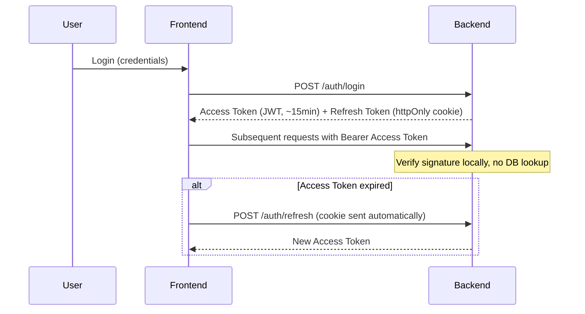
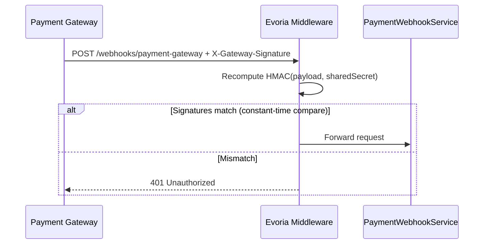

# Security Design
## Evoria — Event Ticketing Platform

| Field | Value |
|---|---|
| Document | Security Design |
| Product | Evoria |
| Version | 1.0 |
| Depends On | [Phase 0 — PRD (NFR-4)](phase-0-prd.md), [Phase 4 — API Design](phase-4-api-design.md), [Phase 5 — LLD](phase-5-lld.md) |

---

## 1. Purpose

This document specifies the concrete mechanisms enforcing the trust boundaries assumed throughout every prior phase — "the authenticated user," "signature verification," "never trust user input" were all referenced but not yet defined. This document defines them.

---

## 2. Threat Model Summary

| Threat Category | Addressed By |
|---|---|
| Identity spoofing | §3 Authentication |
| Privilege escalation / IDOR | §4 Authorization |
| Forged server-to-server requests | §5 Webhook Authentication |
| SQL Injection / XSS | §6 Injection Prevention |

---

## 3. Authentication — JWT + Refresh Tokens

### 3.1 Mechanism
- **Access Token:** a short-lived (~15 min), signed JWT issued at login, containing claims (`userId`, `role`, expiry). Verified independently by any Backend instance via signature check — no central session store lookup required
- **Refresh Token:** a long-lived token stored in an httpOnly cookie (inaccessible to JavaScript, mitigating XSS-based theft), used solely to obtain a new Access Token

### 3.2 Rationale
Stateless verification is required because the Backend (Phase 2, §3.2) is horizontally scaled — any instance must be able to verify identity without a shared session store. Splitting into two tokens balances security (short-lived credential limits exposure if stolen) against usability (long-lived credential avoids forcing repeated logins).

### 3.3 Token Flow

---

## 4. Authorization — Role Checks vs. Ownership Checks

### 4.1 Two Distinct Checks

| Check | Granularity | Question | Enforced At |
|---|---|---|---|
| **Role check** | Coarse | Can this *type* of user attempt this action at all? | Middleware, before the Controller |
| **Ownership check** | Fine | Does *this specific* resource belong to *this* user? | Service layer, where the resource is already loaded |

### 4.2 Why Both Are Required
A role check alone (e.g., "is this user an Attendee?") permits an Attendee to attempt `POST /bookings/:bookingId/cancel` on **any** booking ID, not just their own — this is the IDOR vulnerability class explicitly flagged in PRD NFR-4. Every endpoint in Phase 4 with a "belongs to a different user → `403`" error case relies on the ownership check defined here.

### 4.3 Application to Existing Endpoints

| Endpoint (Phase 4) | Role Required | Ownership Check |
|---|---|---|
| `POST /events` | `ORGANIZER`, approved | — |
| `POST /bookings/:id/cancel` | `ATTENDEE` | `booking.userId == authenticatedUserId` |
| `PATCH /events/:id/publish` | `ORGANIZER` | `event.organizerId == authenticatedUserId` |
| `PATCH /organizers/:id/approval` | `ADMIN` | — |

---

## 5. Webhook Authentication — HMAC Signature Verification

### 5.1 Why a Different Mechanism
`POST /webhooks/payment-gateway` (Phase 4, §4.6) has no human user and no login flow — JWT (§3) does not apply. The caller is a trusted external system, requiring a different authentication model entirely.

### 5.2 Mechanism
1. Evoria and the Payment Gateway share a secret key, established out-of-band during integration setup
2. The Gateway computes an HMAC hash of the payload using the shared secret, sent as a header (e.g., `X-Gateway-Signature`)
3. Evoria's Controller-level middleware independently recomputes the hash from the received payload and its own copy of the secret
4. The two hashes are compared using a **constant-time comparison function** — never a naive `==`, which can leak timing information exploitable to guess the signature byte-by-byte

### 5.3 Guarantees Provided
- **Authenticity** — the request came from someone who possesses the shared secret
- **Integrity** — the payload was not altered in transit (any change produces a different hash)

---

## 6. Injection Prevention

### 6.1 SQL Injection

| Aspect | Detail |
|---|---|
| **Attack vector** | Untrusted input (e.g., `search` query param, Phase 4 §4.1) concatenated directly into a SQL command |
| **Example payload** | `'; DROP TABLE users; --` |
| **Mitigation** | Parameterized queries / prepared statements — user input is passed separately from query structure, never interpreted as part of the command. Enforced by correct ORM/query-builder usage |

### 6.2 Cross-Site Scripting (XSS)

| Aspect | Detail |
|---|---|
| **Attack vector** | Stored user-generated content (e.g., Event description, Phase 4 §4.8) containing executable markup, rendered without escaping |
| **Example payload** | `` |
| **Mitigation** | Output encoding at render time — stored content is always treated as data to display, never as markup to execute. React (our Frontend framework) escapes rendered text by default |

### 6.3 Shared Root Cause
Both vulnerability classes share one principle: untrusted input must never cross the boundary from "data" into "executable instructions" — whether that boundary is a SQL query or rendered HTML.

---

## 7. Layered Defense Summary

| Layer | Threat Addressed | Mechanism | Independent? |
|---|---|---|---|
| Authentication | Identity spoofing | JWT + Refresh Token | Does not protect against injection or IDOR |
| Authorization | Privilege escalation, IDOR | Role + ownership checks | Does not protect against forged server calls |
| Server-to-Server Trust | Forged webhook calls | HMAC signature | Does not protect against XSS/SQLi |
| Input Trust | SQL Injection, XSS | Parameterized queries, output escaping | Does not protect against broken authorization |

No layer substitutes for another — each closes a gap the others structurally cannot address.

---

## 8. Out of Scope for This Document

- Encryption-at-rest configuration for the Database (an infrastructure/deployment concern, Phase 11)
- Rate limiting and abuse prevention (Phase 7 — Scalability Design)
- TLS/HTTPS termination configuration (Phase 11 — Deployment)
