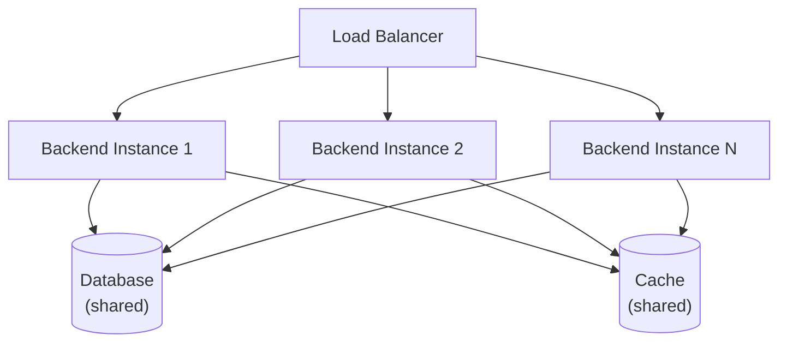
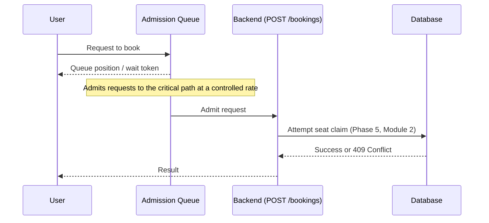
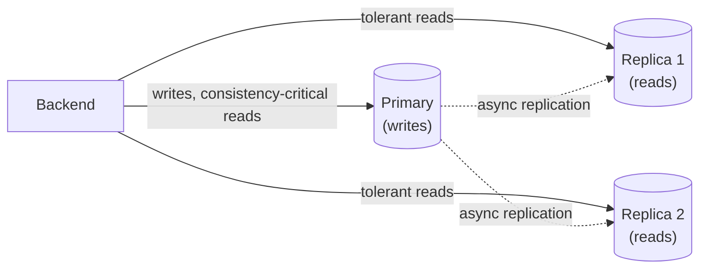

# Scalability Design
## Evoria — Event Ticketing Platform

| Field | Value |
|---|---|
| Document | Scalability Design |
| Product | Evoria |
| Version | 1.0 |
| Depends On | [Phase 0 — PRD (NFR-2, NFR-3)](phase-0-prd.md), [Phase 2 — HLD](phase-2-hld.md), [Phase 5 — LLD](phase-5-lld.md), [Phase 6 — Security Design](phase-6-security-design.md) |

---

## 1. Purpose

PRD NFR-2 identified two distinct scaling problems — read scalability (Discovery) and write-contention scalability (Booking flash sales) — and required them to be solved independently. This document defines the concrete mechanisms for both, plus the Backend capacity scaling that underlies the whole system.

---

## 2. The Three Bottleneck Categories

| Bottleneck | Symptom | NOT Solved By | Solved By |
|---|---|---|---|
| **Capacity** | Too many requests for one server | — | Horizontal Backend scaling (§3) |
| **Contention** | Many requests competing for the same limited rows | More servers (§3) — can worsen it | Admission control (§4) |
| **Read load** | High-volume reads beyond what Cache absorbs | More servers (§3) alone | Database read replicas (§5) |

Misapplying one bottleneck's fix to another is the most common real-world scaling mistake — each is addressed below independently.

---

## 3. Horizontal Backend Scaling (Capacity)

### 3.1 Mechanism
A Load Balancer distributes requests across N identical, stateless Backend instances. Any instance can serve any request.

### 3.2 Prerequisites (Established in Earlier Phases)
- **No in-memory session state** — all durable state lives in the shared Database/Cache (Phase 2)
- **Stateless authentication** — JWT signature verification requires no per-server session lookup (Phase 6, §3)

Without both, horizontal scaling would require **session affinity** (sticky sessions), which reintroduces server-specific coupling and undermines the benefit of scaling out.

### 3.3 What This Pillar Does NOT Solve
Raw request capacity. It does not relieve database-level row contention (§4) or reduce read load against the primary database (§5) — adding more Backend instances under contention can increase lock contention, not reduce it.

---

## 4. Write-Contention Admission Control (Flash Sales)

### 4.1 The Problem
A flash sale (e.g., a high-demand Show going on sale) generates many more concurrent `POST /bookings` (Phase 4, §4.4) requests than there are seats. Every request — regardless of how many Backend instances receive it — ultimately contends for the same small set of `Seat` rows via the atomic conditional update (Phase 5, Module 3). More Backend capacity does not relieve this; it can worsen it by increasing concurrent connections against the same contended rows.

### 4.2 Mechanism — Virtual Waiting Room

Requests are queued and admitted to the actual booking-attempt path at a sustainable rate, rather than allowing unlimited concurrent attempts against the Database.

### 4.3 Relationship to the Existing Message Queue
This admission queue uses the same underlying technology as the Notification queue (Phase 2, Component 6, RabbitMQ) but is a **separate, distinct queue** serving an opposite purpose:

| | Notification Queue (Phase 2) | Admission Queue (this phase) |
|---|---|---|
| **Purpose** | Prevent a slow consumer from blocking the critical path | Deliberately throttle access to the critical path |
| **Direction** | Decouples a side effect from its trigger | Controls ingress to a contended resource |

### 4.4 Consequence of Not Implementing This
Without admission control, sufficient contention can degrade the Database for **all** users — including those not even attempting to book the contended Show — not just produce slow responses for the requests directly involved.

---

## 5. Database Read Replicas (Read Load)

### 5.1 Mechanism
- **Primary** — accepts all writes (Bookings, Payments, Seats); the only instance enforcing NFR-1 consistency
- **Read Replicas** — asynchronously copy the primary's data; serve read-only traffic that the Cache (Phase 2) doesn't already absorb

### 5.2 The Critical Constraint
Replication is **asynchronous** — replicas may lag the primary by milliseconds to seconds. Per NFR-3, this staleness is acceptable for Discovery reads but **must never** be used for any read that feeds a consistency-critical decision (e.g., checking seat availability immediately before a claim attempt, Phase 5, Module 2) — doing so would silently reintroduce the double-booking risk NFR-1 exists to prevent.

### 5.3 Routing Rule

| Read Type | Routed To |
|---|---|
| Discovery (Phase 4, §4.1–4.3), cache misses | Read Replica |
| Admin reporting/dashboards | Read Replica |
| Seat availability check immediately before a claim (Phase 5, Module 2) | **Primary, always** |
| Any read inside a write transaction | **Primary, always** |

---

## 6. Summary — NFR-2 Coverage

| NFR-2 Requirement | Addressed By |
|---|---|
| Read scalability | Cache (Phase 2) + Read Replicas (§5) |
| Write-contention scalability | Admission Control (§4), backed by the consistency guarantee from Phase 5 |
| General request capacity | Horizontal Backend Scaling (§3) |

---

## 7. Out of Scope for This Document

- Specific load balancer product/configuration (Phase 11 — Deployment)
- Auto-scaling trigger thresholds (Phase 11 — Deployment)
- Database sharding (not required at v1 scale; a candidate for future iteration if a single primary becomes a write bottleneck)
